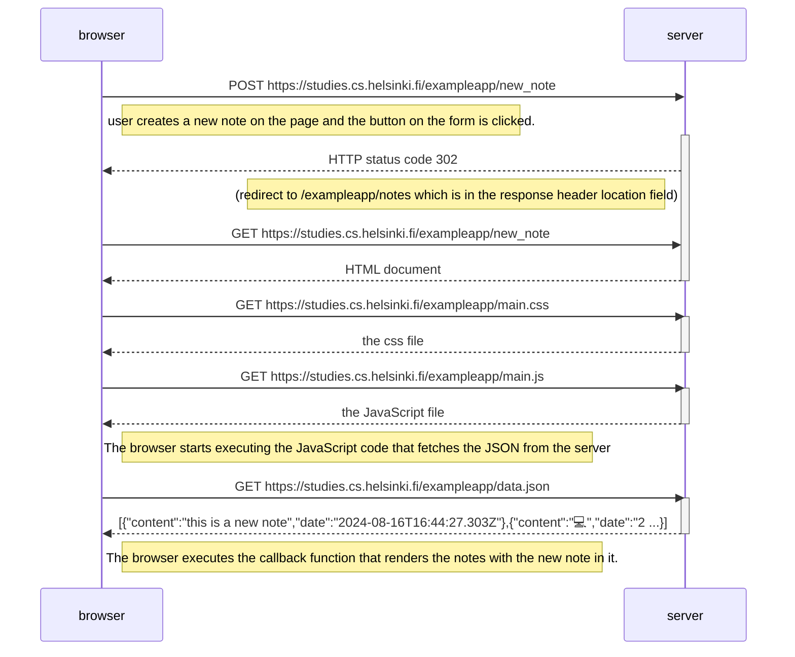

```mermaid
sequenceDiagram

    participant browser
    participant server
    browser->>server: POST https://studies.cs.helsinki.fi/exampleapp/new_note
    Note right of browser: user creates a new note on the page and the button on the form is clicked.
    activate server
    server-->>browser: HTTP status code 302
    Note left of server: (redirect to /exampleapp/notes which is in the response header location field)
    browser->>server: GET https://studies.cs.helsinki.fi/exampleapp/new_note
    server-->>browser: HTML document
    deactivate server

    browser->>server: GET https://studies.cs.helsinki.fi/exampleapp/main.css
    activate server
    server-->>browser: the css file
    deactivate server

    browser->>server: GET https://studies.cs.helsinki.fi/exampleapp/main.js
    activate server
    server-->>browser: the JavaScript file
    deactivate server

    Note right of browser: The browser starts executing the JavaScript code that fetches the JSON from the server

    browser->>server: GET https://studies.cs.helsinki.fi/exampleapp/data.json
    activate server
    server-->>browser: [{"content":"this is a new note","date":"2024-08-16T16:44:27.303Z"},{"content":"💻","date":"2 ...}]
    deactivate server

    Note right of browser: The browser executes the callback function that renders the notes with the new note in it.
```
