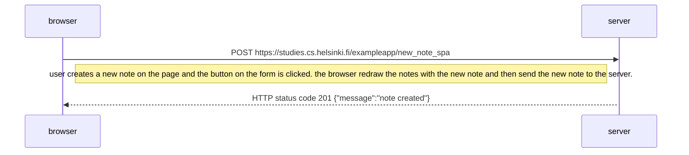

```mermaid
sequenceDiagram

    participant browser
    participant server
    browser->>server: POST https://studies.cs.helsinki.fi/exampleapp/new_note_spa
    Note right of browser: user creates a new note on the page and the button on the form is clicked. the browser redraw the notes with the new note and then send the new note to the server.

    activate server

    server-->>browser: HTTP status code 201 {"message":"note created"}

```
